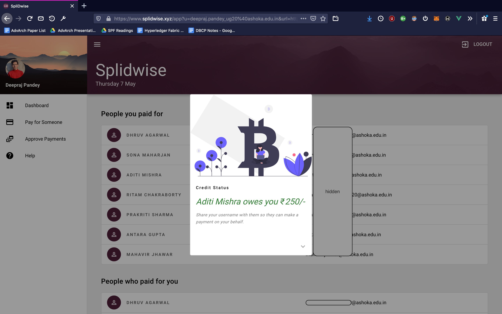
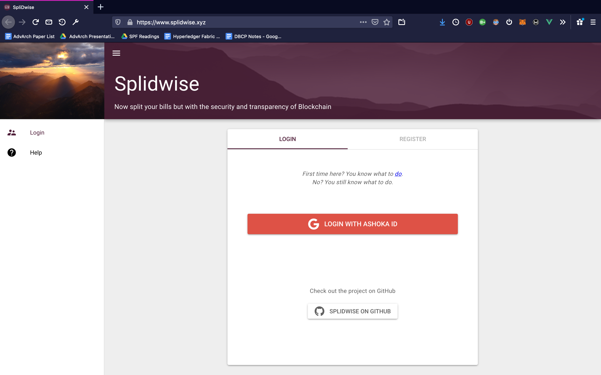
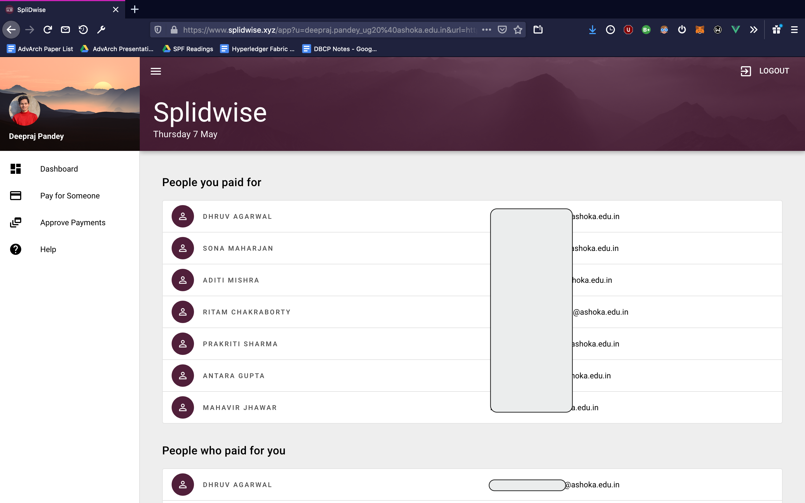
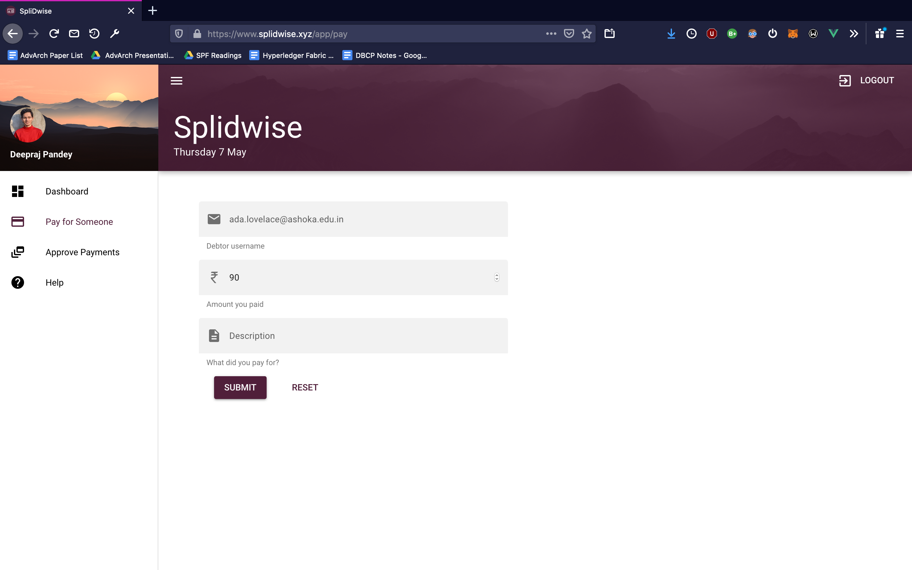
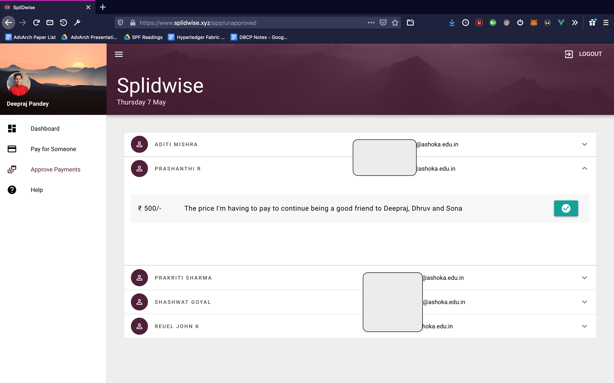

# SpliDwise
SpliDwise is a distributed version of a popular similar application called Splitwise implemented on Hyperledger Fabric.
The client facing application is built with Vue.js and the backend api is set up with Express.js which talks to the Fabric
Network (simple setup with only 1 organisation which approves transactions).

⚠️ We are currently migrating from a personal AWS Instance to a server hosted by the University. The service will be up after finals week. Thanks for your understanding.



## API Documentation

The full documentation is hosted here: https://relaxed-dijkstra-a3d3bb.netlify.com

The documentation comes with a playground set up with the staging server hosted on Heroku. You can make **all** the calls from within the documentation but if you want to test it out yourself, you can do that [here](https://fathomless-fortress-82121.herokuapp.com). A rate limit of 80 requests/hour is enforced since the staging server is currently on free dynos. 

## Setup

SpliDwise is under active development right now and might have multiple breaking changes throughout. Expect the entire
application to change drastically often.

### Install Dependencies
We assume [node](https://nodejs.org/en/) and [tmux](https://github.com/tmux/tmux/wiki) are installed on the system.

1. Move into the splidwise directory. From this point on, all commands are run in this directory.
```sh
$ cd hyperledger-backend/splidwise
```

2. Install the dependencies and also ensure that docker is running
```sh
$ npm install
```

2. Run the start script.
```sh
$ ./startSplidwise.sh
```
This will start the docker containers to set up the Fabric network, and then start the API server in a new TMUX Session and name it [server]. It will then run another script that will make a few api calls to initialise the network with a few users, and some activity between them (take a look at `splidwise/services/init-requests.json` for the api requests made).

In the end, it will attach to the Tmux server session where you can see real time logs when more calls are made.

3. In a separate terminal session, start the client (with debugging)
```sh
$ cd ../ui
$ quasar dev
```
This is still under development and will be a part of the final milestone.

4. You can now access the application at http://localhost:8080

### Logs
- To access chaincode logs after `startSplidwise.sh` script has successfully run, run this command in a new terminal session
```sh
docker logs -f dev-peer0.org1.example.com-splidwise-1.0
```

- To access the server logs, attach to the server tmux session from another terminal session.
```sh
tmux attach -t server
```
To detach from the server session and leave it running, use the key combinations `Ctrl+b` followed by `d`. Here's a [cheatsheet](https://tmuxcheatsheet.com) with more tmux commands.

### Screenshots
1. Login

2. Dashboard

4. Payment

5. Unapproved Payments

